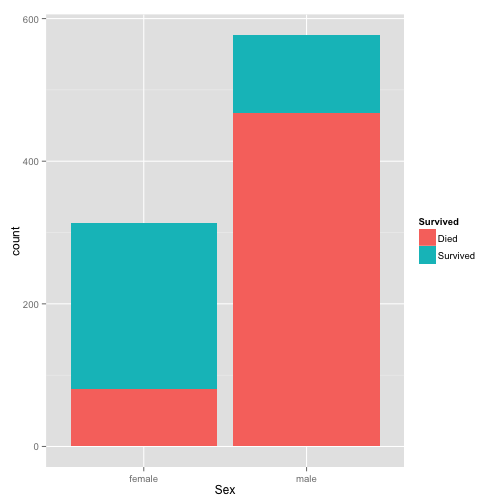
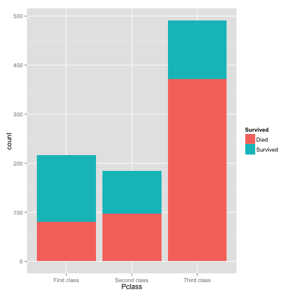
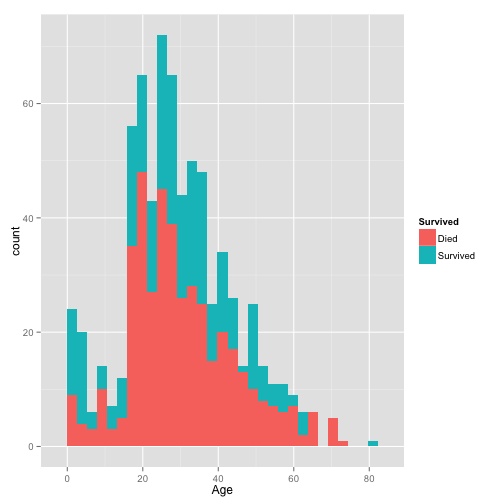
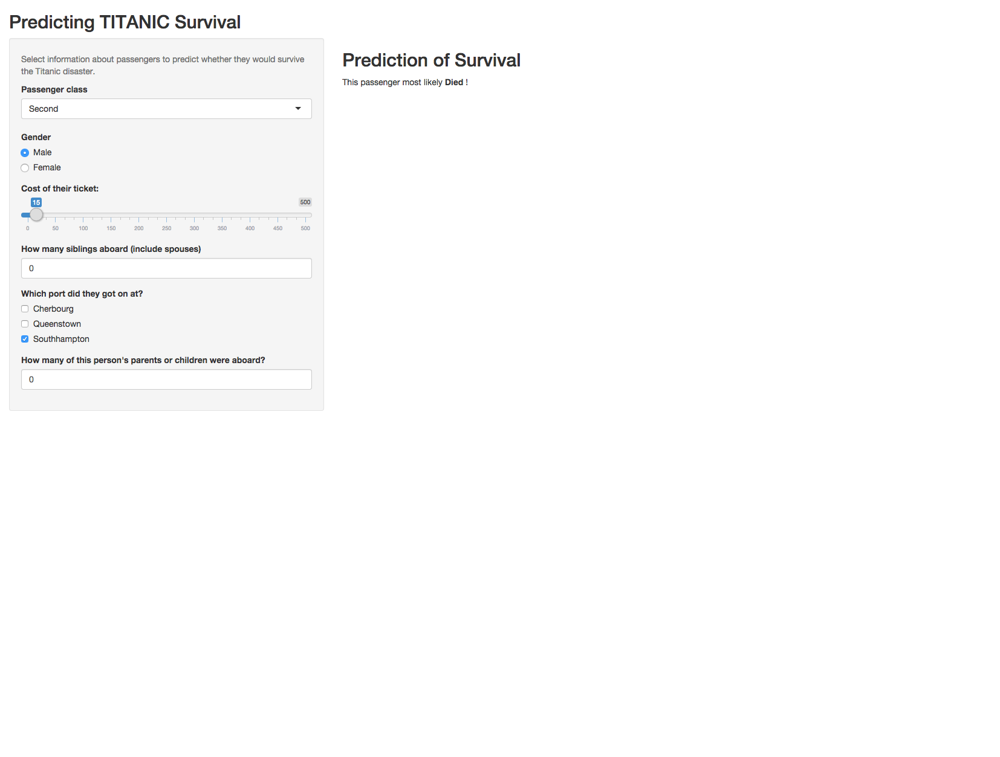

Predicting Titanic Survival
========================================================
author: beaunorgeot
date: 8-19-2015
transition: rotate

A Great Tragedy
========================================================

***
On the night of April 14th, 1912, the RMS Titanic sunk in the north Atlanic Ocean. 

More than 1,500 of the 2,224 passengers perished making it one of the most recognizable maritime disasters in history. 

Survival was not stochastic
========================================================
left:30%

  

***
 
***
Survival was heavily dependent upon passenger personal characteristics.

Predicting Survival
========================================================

My Shiny App allows users to adjust key passenger characteristics, such as Gender or which class the person traveled in, and receive a prediction (generated by a Random Forest) about whether that person survived the disaster.

It's fun, you should try it!

NEED A LINK HERE AND AN IMAGE OF THE PRIMARY PAGE

Using the Survival Prediction App
=====================================================

The application is reactive, so changing any of the passenger data (Class, Gender, etc) automatically generates a new Survival prediction.

This predictive model is intentionally simplistic. Even so, it correctly classifies Survival approximately 80% of the time

I will update the app w/a more complex model that includes predictors such as age and Title if there is interest. Feel free to email me: beaunorgeot@gmail.com
